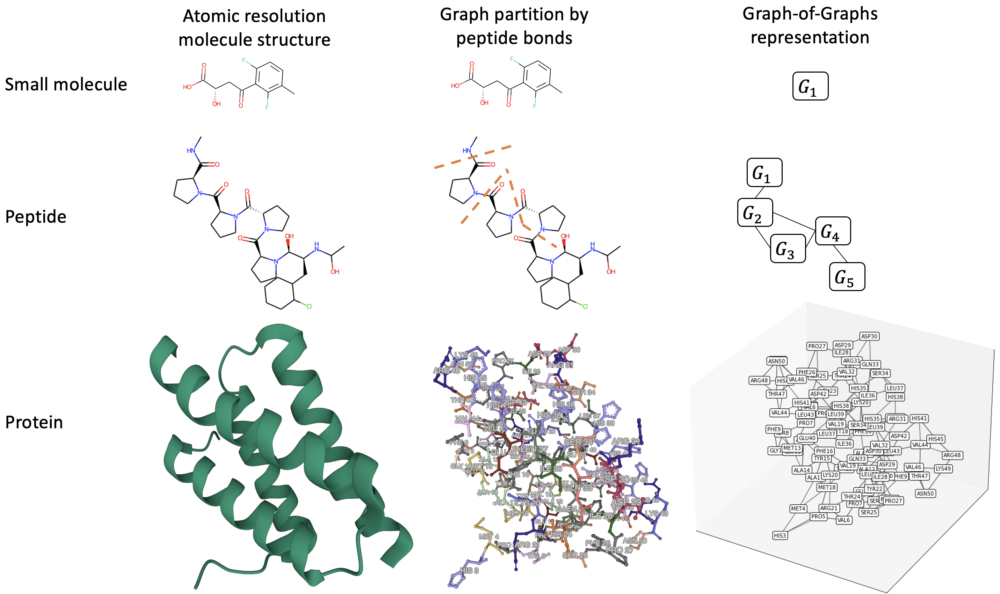

# EGGNet: Equivariant Graph-of-Graphs Neural Network

Source code for "[EGGNet, a generalizable geometric deep learning framework for protein complex pose scoring](https://www.biorxiv.org/content/10.1101/2023.03.22.533800v1)"



## Dependencies

All experiments were performed in Python 3.8 with Pytorch (v1.10). 

To install all dependencies run:
```
$ pip install dgl-cu111 dglgo -f https://data.dgl.ai/wheels/repo.html
$ pip install -r requirements.txt
```

## Training

Training of EGGNet and competing models for protein complex scoring tasks can be done in `train.py`, which utilizes the [PyTorch Lightning Trainer](https://pytorch-lightning.readthedocs.io/en/latest/common/trainer.html#). All of the [trainer flags](https://pytorch-lightning.readthedocs.io/en/latest/common/trainer.html#trainer-flags) in PyTorch Lightning are supported. To see the usage, run: 

```
$ python train.py -h
usage: train.py [-h] [--logger [LOGGER]] [--enable_checkpointing [ENABLE_CHECKPOINTING]] [--default_root_dir DEFAULT_ROOT_DIR] [--gradient_clip_val GRADIENT_CLIP_VAL]
                [--gradient_clip_algorithm GRADIENT_CLIP_ALGORITHM] [--num_nodes NUM_NODES] [--num_processes NUM_PROCESSES] [--devices DEVICES] [--gpus GPUS] [--auto_select_gpus [AUTO_SELECT_GPUS]]
                [--tpu_cores TPU_CORES] [--ipus IPUS] [--enable_progress_bar [ENABLE_PROGRESS_BAR]] [--overfit_batches OVERFIT_BATCHES] [--track_grad_norm TRACK_GRAD_NORM]
                [--check_val_every_n_epoch CHECK_VAL_EVERY_N_EPOCH] [--fast_dev_run [FAST_DEV_RUN]] [--accumulate_grad_batches ACCUMULATE_GRAD_BATCHES] [--max_epochs MAX_EPOCHS]
                [--min_epochs MIN_EPOCHS] [--max_steps MAX_STEPS] [--min_steps MIN_STEPS] [--max_time MAX_TIME] [--limit_train_batches LIMIT_TRAIN_BATCHES] [--limit_val_batches LIMIT_VAL_BATCHES]
                [--limit_test_batches LIMIT_TEST_BATCHES] [--limit_predict_batches LIMIT_PREDICT_BATCHES] [--val_check_interval VAL_CHECK_INTERVAL] [--log_every_n_steps LOG_EVERY_N_STEPS]
                [--accelerator ACCELERATOR] [--strategy STRATEGY] [--sync_batchnorm [SYNC_BATCHNORM]] [--precision PRECISION] [--enable_model_summary [ENABLE_MODEL_SUMMARY]]
                [--weights_save_path WEIGHTS_SAVE_PATH] [--num_sanity_val_steps NUM_SANITY_VAL_STEPS] [--resume_from_checkpoint RESUME_FROM_CHECKPOINT] [--profiler PROFILER] [--benchmark [BENCHMARK]]
                [--deterministic [DETERMINISTIC]] [--reload_dataloaders_every_n_epochs RELOAD_DATALOADERS_EVERY_N_EPOCHS] [--auto_lr_find [AUTO_LR_FIND]] [--replace_sampler_ddp [REPLACE_SAMPLER_DDP]]
                [--detect_anomaly [DETECT_ANOMALY]] [--auto_scale_batch_size [AUTO_SCALE_BATCH_SIZE]] [--plugins PLUGINS] [--amp_backend AMP_BACKEND] [--amp_level AMP_LEVEL]
                [--move_metrics_to_cpu [MOVE_METRICS_TO_CPU]] [--multiple_trainloader_mode MULTIPLE_TRAINLOADER_MODE] [--model_name MODEL_NAME]

optional arguments:
  -h, --help            show this help message and exit
  --model_name MODEL_NAME
                        Choose from gvp, hgvp, multistage-gvp, multistage-hgvp

pl.Trainer:
  --logger [LOGGER]     Logger (or iterable collection of loggers) for experiment tracking. A ``True`` value uses the default ``TensorBoardLogger``. ``False`` will disable logging. If multiple loggers
  # other pl.Trainer flags...
```

## Data preparation

PDBbind/CASF-2016 data can be downloaded using [the script](https://github.com/ACE-KAIST/PIGNet/blob/main/data/download_train_data.sh) from the PIGNet repository. 

## Citation

Please cite the following preprint:
```
@article {Wang2023.03.22.533800,
	author = {Wang, Zichen and Brand, Ryan and Adolf-Bryfogle, Jared and Grewal, Jasleen and Qi, Yanjun and Combs, Steven A. and Golovach, Nataliya and Alford, Rebecca and Rangwala, Huzefa and Clark, Peter M.},
	title = {EGGNet, a generalizable geometric deep learning framework for protein complex pose scoring},
	elocation-id = {2023.03.22.533800},
	year = {2023},
	doi = {10.1101/2023.03.22.533800},
	publisher = {Cold Spring Harbor Laboratory},
	abstract = {Computational prediction of molecule-protein interactions has been key for developing new molecules to interact with a target protein for therapeutics development. Literature includes two independent streams of approaches: (1) predicting protein-protein interactions between naturally occurring proteins and (2) predicting the binding affinities between proteins and small molecule ligands (aka drug target interaction, or DTI). Studying the two problems in isolation has limited computational models{\textquoteright} ability to generalize across tasks, both of which ultimately involve non-covalent interactions with a protein target. In this work, we developed Equivariant Graph of Graphs neural Network (EGGNet), a geometric deep learning framework for molecule-protein binding predictions that can handle three types of molecules for interacting with a target protein: (1) small molecules, (2) synthetic peptides and (3) natural proteins. EGGNet leverages a graph of graphs (GoGs) representation constructed from the molecule structures at atomic-resolution and utilizes a multiresolution equivariant graph neural network (GNN) to learn from such representations. In addition, EGGNet gets inspired by biophysics and makes use of both atom- and residue-level interactions, which greatly improve EGGNet{\textquoteright}s ability to rank candidate poses from blind docking. EGGNet achieves competitive performance on both a public proteinsmall molecule binding affinity prediction task (80.2\% top-1 success rate on CASF-2016) and an synthetic protein interface prediction task (88.4\% AUPR). We envision that the proposed geometric deep learning framework can generalize to many other protein interaction prediction problems, such as binding site prediction and molecular docking, helping to accelerate protein engineering and structure-based drug development.Competing Interest StatementThe authors have declared no competing interest.},
	URL = {https://www.biorxiv.org/content/early/2023/03/22/2023.03.22.533800},
	eprint = {https://www.biorxiv.org/content/early/2023/03/22/2023.03.22.533800.full.pdf},
	journal = {bioRxiv}
}
```

## Security

See [CONTRIBUTING](CONTRIBUTING.md#security-issue-notifications) for more information.

## License

This library is licensed under the MIT-0 License. See the LICENSE file.
